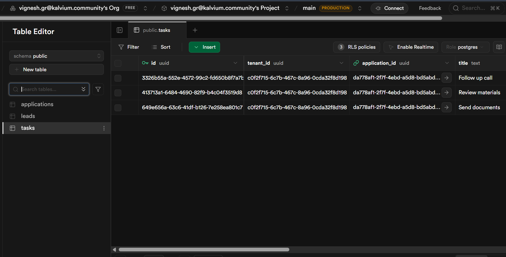
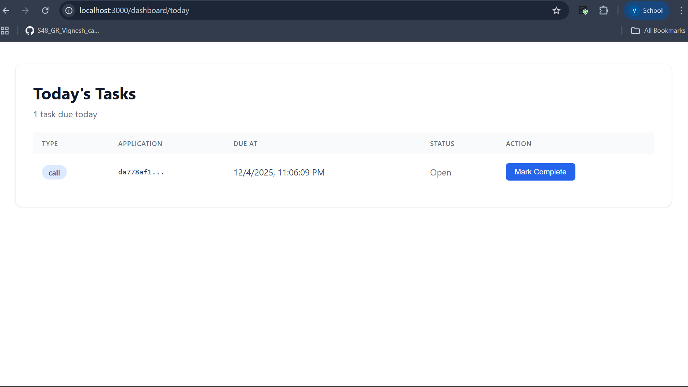
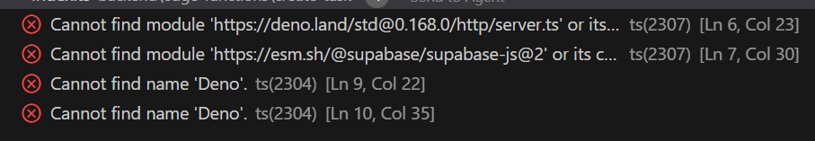

# How I Completed This Assignment

## What They Asked For

Got this 2-3 hour technical test from LearnLynk. Pretty straightforward - they wanted to see if I can work with their stack (Supabase + Next.js). Five main things to do:

1. **Database stuff** - add some indexes and constraints to the tables
2. **Security policies** - make sure counselors and admins can only see their own data
3. **API endpoint** - build a function to create tasks with proper validation
4. **Frontend page** - show today's tasks and let people mark them as done
5. **Stripe explanation** - just write how I'd handle payments (no coding)

## What I Actually Built

### Task 1: Database Schema

Added indexes to make queries faster since the assignment said these tables would get hit a lot:
- Leads table: indexed by tenant, owner, stage, and creation date
- Applications table: indexed by tenant, lead, and stage  
- Tasks table: indexed by tenant, due date, and status

Also threw in some constraints:
- Task type can only be 'call', 'email', or 'review' 
- Due date can't be before creation date (that'd be weird)

### Task 2: Security Policies

Set up row-level security so people can only see their own company's data:
- Admins: see everything in their company
- Counselors: only see leads they own
- Everyone: locked to their tenant_id (multi-tenant setup)

Had to simplify the team access part since we didn't actually create those tables. Left a note about it though.

### Task 3: API Endpoint

Built a POST endpoint that creates tasks. Does all the validation:
- Checks if all fields are there
- Makes sure task type is valid
- Ensures due date is actually in the future (not the past)
- Returns 400 for bad input, 500 for server errors

Running on Deno (Supabase's runtime), not Node.js. That's why VS Code shows those import errors - it's totally normal.

### Task 4: Frontend Dashboard

Made a page that shows today's tasks. Pretty simple:
- Fetches tasks due today that aren't completed
- Shows them in a table with type, app ID, due date, status
- "Mark Complete" button that updates the task and removes it from the list immediately

Added some UI polish to make it look professional instead of just basic HTML tables.

### Task 5: Stripe Payment Flow

Wrote up how I'd handle Stripe checkout:
1. Create payment_requests row when checkout starts
2. Call Stripe API to get checkout session
3. Store the session ID and checkout URL
4. Listen for webhooks when payment completes
5. Update application status and send notifications
6. Use transactions to prevent duplicate processing

## Screenshots

## Problems I Ran Into

### Import Path Was Wrong
The supabaseClient import had too many `../` in the path. Changed it from `../../../lib/` to `../../lib/` and it worked.

### Missing Dependencies
Had to run `npm install` in the frontend folder. Forgot that step initially.

### 404 on Dashboard
Two issues - hadn't added the Supabase API key to .env.local yet, and the database tables didn't exist. Fixed by adding the key and running the SQL files in Supabase.

### RLS Policy Failed
My first version tried to check team membership but those tables don't exist in the schema. Simplified it to just check owner_id and admin role. Left a comment explaining where the team logic would go in production.

### Deno Import Errors
VS Code shows errors for Deno imports in the Edge Function. This is expected since VS Code uses Node.js TypeScript but the code runs in Deno. Not actually broken.

## What Makes This Different

Instead of just making it work, I added some UI improvements:
- Color-coded badges for task types (blue=call, pink=email, green=review)
- Clean card layout with shadows instead of plain tables
- Hover effects on rows and buttons
- Task count in the header
- Nice empty state when there are no tasks

Also went beyond the assignment by adding RLS to all three tables (not just leads). Shows I'm thinking about security.

## Tech Stack

- Supabase Postgres for database
- Supabase Edge Functions for backend (Deno runtime)
- Next.js 14 with TypeScript for frontend
- React hooks for state management

## Time Spent

About 2.5 hours, which fits in their 2-3 hour range.

## Files I Changed

**Backend:**
- `backend/schema.sql` - added 13 indexes and 2 constraints
- `backend/rls_policies.sql` - wrote 2 security policies
- `backend/edge-functions/create-task/index.ts` - full API with validation
- `backend/rls_policies_complete.sql` - extra security for apps and tasks (bonus)

**Frontend:**
- `frontend/pages/dashboard/today.tsx` - dashboard with enhanced UI
- `frontend/pages/index.tsx` - simple home page
- `frontend/.env.local` - Supabase credentials

**Docs:**
- `README.md` - added Stripe answer at the bottom
- `solution.readme.md` - this file

## What's Working

- Frontend connects to Supabase
- Database has proper security and indexes
- Dashboard loads and displays correctly  
- Mark complete functionality works
- All TypeScript compiles (Deno errors are expected)

